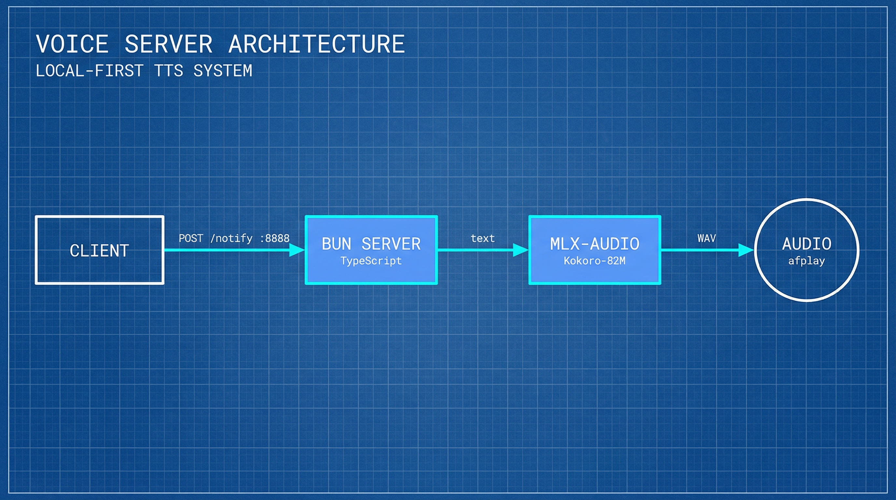

# API Reference

The voice server provides a simple HTTP API for text-to-speech notifications and health checks.

## Architecture Overview



The voice server uses a modular architecture:
- **Bun Server** - TypeScript HTTP API handling requests and validation
- **MLX-audio** - Local TTS backend using the Kokoro-82M model
- **macOS Integration** - Native audio playback via afplay

## Base URL

```
http://localhost:8888
```

Default port is `8888`. Can be customized with `PORT` environment variable.

## Endpoints

### POST /notify

Send a notification with text-to-speech.

#### Request

```bash
curl -X POST http://localhost:8888/notify \
  -H "Content-Type: application/json" \
  -d '{
    "title": "Hello",
    "message": "This is a test notification",
    "voice_id": "1",
    "volume": 1.0
  }'
```

#### Request Body

| Field | Type | Required | Description |
|-------|------|----------|-------------|
| `title` | string | No | Notification title (default: "Notification") |
| `message` | string | **Yes** | Text to speak |
| `voice_id` | string | No | Numeric voice ID 1-41 (default: "1") |
| `voice_settings` | object | No | Voice configuration |
| `volume` | number | No | Volume 0.0-1.0 (default: 1.0) |
| `voice_enabled` | boolean | No | Enable TTS (default: true) |

#### Voice Settings

| Field | Type | Description |
|-------|------|-------------|
| `speed` | number | Speaking speed (0.5-2.0, default: 1.0) |
| `stability` | number | Speech consistency (0.0-1.0) |
| `style` | number | Speaking style (0.0-1.0) |

#### Response

**Success (200):**
```json
{
  "status": "success",
  "message": "Notification sent"
}
```

**Error (400):**
```json
{
  "error": "Message is required"
}
```

#### Example

```bash
# Test with voice 1 (warm, friendly)
curl -X POST http://localhost:8888/notify \
  -H "Content-Type: application/json" \
  -d '{"message": "Hello from Kokoro TTS!", "voice_id": "1"}'

# Test with voice 12 (professional male) and custom speed
curl -X POST http://localhost:8888/notify \
  -H "Content-Type: application/json" \
  -d '{
    "message": "This is a professional announcement",
    "voice_id": "12",
    "voice_settings": {"speed": 1.1}
  }'
```

---

### POST /pai

PAI-specific notification endpoint with default voice settings optimized for PAI agent voices.

#### Request

```bash
curl -X POST http://localhost:8888/pai \
  -H "Content-Type: application/json" \
  -d '{
    "title": "PAI Alert",
    "message": "Task completed successfully"
  }'
```

#### Request Body

Same fields as `/notify`, but uses PAI-optimized defaults:
- Default `voice_id`: "12" (professional male)
- Default `volume`: 1.0
- Default `voice_enabled`: true

#### Response

```json
{
  "status": "success",
  "message": "Notification sent"
}
```

---

### GET /health

Health check endpoint with server status and voice system information.

#### Request

```bash
curl http://localhost:8888/health
```

#### Response

```json
{
  "status": "healthy",
  "port": 8888,
  "voice_system": "Kokoro-82M",
  "default_voice_id": "1",
  "model_loaded": true,
  "available_voices": ["1", "2", "3", "..."]
}
```

#### Response Fields

| Field | Type | Description |
|-------|------|-------------|
| `status` | string | Server status ("healthy" or "unhealthy") |
| `port` | number | Server port |
| `voice_system` | string | TTS backend name |
| `default_voice_id` | string | Default voice ID |
| `model_loaded` | boolean | Whether TTS model is loaded |
| `available_voices` | array | List of available voice IDs |

---

## Voice IDs

The server supports 41 built-in Kokoro voices accessed via numeric IDs (1-41).

### Popular Voices

| ID | Voice | Description |
|----|-------|-------------|
| **1** | af_heart | Warm, friendly (default) |
| **4** | af_sky | Bright, energetic |
| **12** | am_michael | Professional male |
| **13** | am_adam | Youthful, energetic |
| **21** | bf_emma | Sophisticated British |

### Voice Categories

| Category | IDs | Examples |
|----------|-----|----------|
| American Female | 1-11 | af_heart, af_sky, af_bella |
| American Male | 12-20 | am_michael, am_adam, am_eric |
| British Female | 21-24 | bf_emma, bf_isabella |
| British Male | 25-28 | bm_george, bm_lewis |
| Japanese | 29-33 | jf_alpha, jm_kumo |
| Chinese | 34-41 | zf_xiaoxiao, zm_yunjian |

See [VOICE_QUICK_REF.md](VOICE_QUICK_REF.md) for complete voice listings.

---

## Configuration

### Environment Variables

| Variable | Default | Description |
|----------|---------|-------------|
| `PORT` | 8888 | Server port |
| `DEFAULT_VOICE_ID` | 1 | Default voice ID (1-41) |
| `MLX_MODEL` | mlx-community/Kokoro-82M-bf16 | MLX model to use |
| `MLX_STREAMING_INTERVAL` | 0.3 | Streaming chunk size (seconds) |
| `ENABLE_MACOS_NOTIFICATIONS` | true | Enable macOS notifications |

### Example Configuration

```bash
# Set custom port
export PORT=9000

# Set default voice
export DEFAULT_VOICE_ID="12"

# Start server with custom config
PORT=9000 DEFAULT_VOICE_ID="12" voice-server
```

---

## Error Codes

| Status | Error | Description |
|--------|-------|-------------|
| 400 | Bad Request | Missing required fields |
| 404 | Not Found | Invalid endpoint |
| 500 | Internal Error | Server error |

### Error Response Format

```json
{
  "error": "Error message description"
}
```

---

## Examples

### Basic Notification

```bash
curl -X POST http://localhost:8888/notify \
  -H "Content-Type: application/json" \
  -d '{"message": "Hello, world!", "voice_id": "1"}'
```

### Custom Voice and Speed

```bash
curl -X POST http://localhost:8888/notify \
  -H "Content-Type: application/json" \
  -d '{
    "message": "This is a fast announcement",
    "voice_id": "4",
    "voice_settings": {"speed": 1.2}
  }'
```

### PAI Agent Notification

```bash
curl -X POST http://localhost:8888/pai \
  -H "Content-Type: application/json" \
  -d '{
    "title": "Engineer Agent",
    "message": "Code compilation successful"
  }'
```

### Health Check

```bash
curl http://localhost:8888/health
```

---

## Integration Examples

### Python

```python
import requests

# Send notification
response = requests.post(
    'http://localhost:8888/notify',
    json={
        'message': 'Hello from Python!',
        'voice_id': '1'
    }
)
print(response.json())
```

### Node.js/Bun

```typescript
const response = await fetch('http://localhost:8888/notify', {
  method: 'POST',
  headers: { 'Content-Type': 'application/json' },
  body: JSON.stringify({
    message: 'Hello from Node.js!',
    voice_id: '1'
  })
});
const result = await response.json();
console.log(result);
```

### JavaScript (Browser)

```javascript
fetch('http://localhost:8888/notify', {
  method: 'POST',
  headers: { 'Content-Type': 'application/json' },
  body: JSON.stringify({
    message: 'Hello from browser!',
    voice_id: '1'
  })
})
.then(r => r.json())
.then(console.log);
```

---

## See Also

- [Voice Guide](VOICE_GUIDE.md) - Complete voice configuration
- [Voice Quick Reference](VOICE_QUICK_REF.md) - All 41 voices
- [Migration Guide](MIGRATION.md) - ElevenLabs migration
- [README](../README.md) - Project documentation
