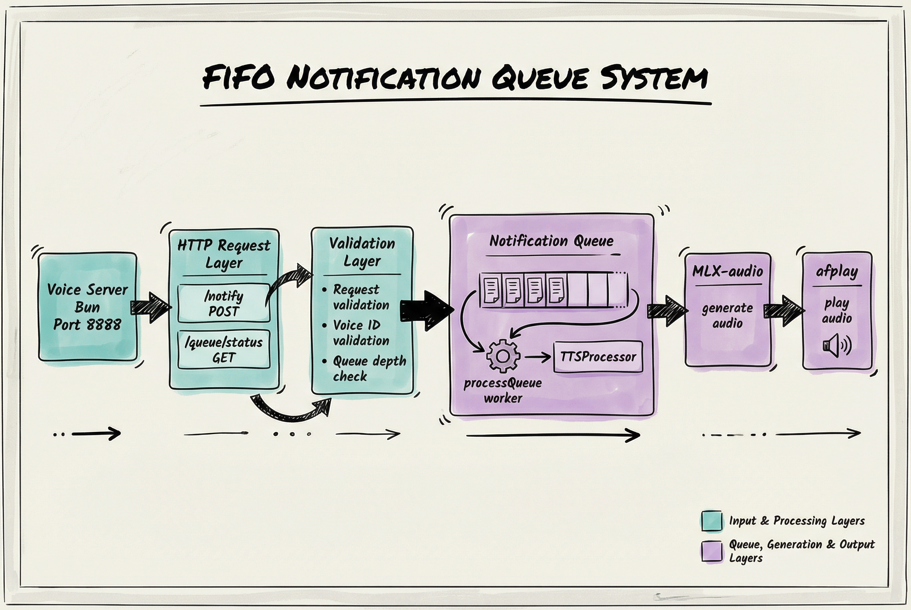
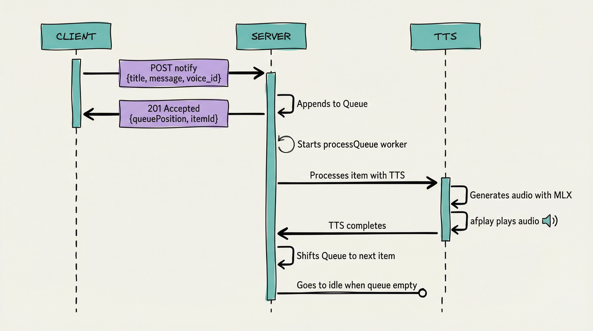
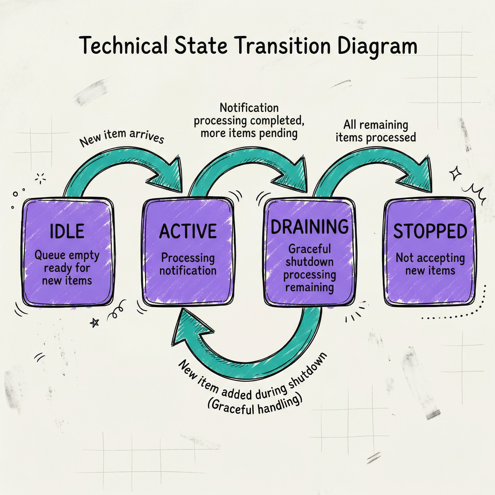

# Queue Architecture

Technical architecture of the FIFO notification queue system.

## System Overview



## Data Models

### QueuedNotification

```typescript
interface QueuedNotification {
  id: string;                    // Unique identifier
  request: NotificationRequest;  // Original request
  status: QueuedItemStatus;       // pending | processing | completed | failed
  arrivedAt: Date;                // When queued
  processingStartedAt?: Date;    // When processing started
  completedAt?: Date;            // When completed
  error?: string;                 // Error message if failed
}
```

### QueueState

```typescript
interface QueueState {
  depth: number;                    // Current queue depth
  processingStatus: QueueProcessingStatus;
  health: QueueHealth;               // healthy | degraded | unavailable
  metrics: QueueMetrics;
}

interface QueueMetrics {
  itemsProcessed: number;          // Total processed
  itemsFailed: number;             // Total failed
  averageProcessingTimeMs: number; // Avg processing time
}
```

## Request Flow

### Successful Notification Flow



### Error Handling Flow

```
Client                          Server                            TTS
  │                                │                                 │
  ├─ POST /notify ────────────────>│                                 │
  │   {title, message, voice_id}    │                                 │
  │                                │                                 │
  │<─ 201 Accepted ──────────────────│                                 │
  │                                │                                 │
  │                                ├─> [Queue: append item]          │
  │                                │                                 │
  │                                ├─> [processQueue: process item]  │
  │                                │                                 │
  │                                │  └──> [TTS: generate audio]    │
  │                                │                                 │
  │                                │<─── [TTS: ERROR!]             │
  │                                │                                 │
  │                                │<─┬─ [Item marked failed]        │
  │                                │  │                              │
  │                                │  └──> [Queue: shift()]          │
  │                                │                                 │
  │                                │<─> [Next item (skip failed)]   │
  │                                │                                 │
```

## Queue States



## Component Interactions

### NotificationQueue Class

```typescript
class NotificationQueue {
  private queue: QueuedNotification[] = [];
  private processingStatus: QueueProcessingStatus = "idle";
  private isProcessing = false;
  private ttsProcessor: TTSProcessor;

  async enqueue(request): Promise<EnqueueResult> {
    // 1. Validate request
    // 2. Check queue depth
    // 3. Add to queue
    // 4. Start processing
    // 5. Return 201 Accepted
  }

  getQueueState(): QueueState {
    // Return current state
  }

  async drain(): Promise<DrainResult> {
    // 1. Set status to draining
    // 2. Wait for queue empty (30s timeout)
    // 3. Stop accepting new items
  }

  private processQueue(): Promise<void> {
    // Single worker processes items sequentially
    while (queue.length > 0 && status !== "stopped") {
      // Process item, handle errors, shift queue
    }
  }
}
```

### TTS Processing Pipeline

```typescript
async function processTTSWithMacOSNotification(request): Promise<void> {
  // 1. Sanitize input
  // 2. Resolve voice settings
  3. Display macOS notification (optional)
  // 4. Process TTS:
  //    a. Generate audio with MLX-audio
  //    b. Play with afplay
  //    c. Clean up temp file
}
```

## Performance Characteristics

### Throughput

- **Accept Rate**: ~10 requests/second (limited by queue depth)
- **Processing Rate**: ~1 notification/7 seconds
- **Queue Depth**: 100 items maximum
- **Burst Capacity**: Can handle bursts of rapid requests

### Latency

- **201 Response**: < 100ms (immediate acceptance)
- **First Audio**: ~7-10 seconds (TTS generation + playback starts)
- **Complete Processing**: ~7-10 seconds per notification

### Resource Usage

- **Memory**: ~1KB per queued item
- **Disk**: Temporary audio files (~100KB each, auto-cleaned)
- **CPU**: MLX-audio TTS generation (Apple Silicon optimized)

## Security Considerations

### Input Validation

- Title and message sanitized before TTS
- Voice ID validated against available voices
- Request size limits enforced

### Rate Limiting

- Applied before queue admission
- Separate 429 response for queue full
- Per-client rate limits available

### Error Isolation

- Failed notifications don't block queue
- TTS failures logged but don't crash server
- Graceful degradation on errors

## Monitoring

### Health Metrics

```json
{
  "depth": 5,
  "processingStatus": "active",
  "health": "healthy",
  "metrics": {
    "itemsProcessed": 156,
    "itemsFailed": 2,
    "averageProcessingTimeMs": 7123
  }
}
```

### Health Indicators

| Health | Condition |
|--------|-----------|
| **healthy** | Queue depth < 50, TTS working |
| **degraded** | Queue depth ≥ 50 OR slow processing |
| **unavailable** | TTS failures > 50% of requests |

### Logging

Key log messages for monitoring:

- `Notification queued` - New item added
- `Processing queued notification` - Processing started
- `Notification processed successfully` - Item completed
- `Notification processing failed` - Item failed
- `Queue drain complete` - Shutdown complete
